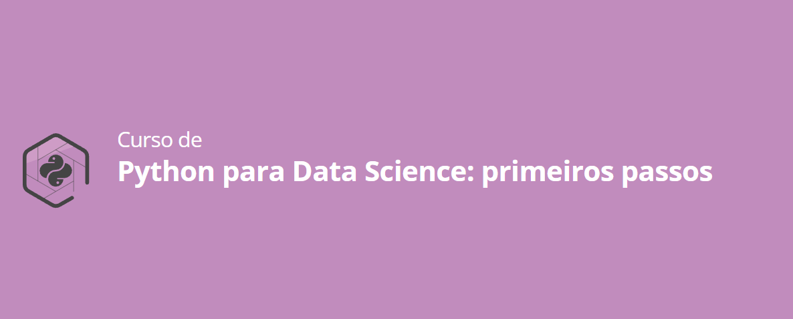

# Python para Data Science: Primeiros Passos

Este repositório contém um guia introdutório sobre a linguagem Python, voltado para iniciantes que desejam iniciar sua jornada em Data Science. Os conteúdos abordados incluem:

## Conteúdos

1. **Comandos Básicos da Linguagem Python**
   - Introdução à sintaxe e estrutura básica do Python.

2. **Tipos de Variáveis**
   - Diferenciação entre tipos de variáveis como inteiros, floats, strings e booleanos.

3. **Manipulação de Tipos Básicos de Dados**
   - Operações básicas com diferentes tipos de dados.

4. **Estruturas Condicionais**
   - Uso de `if`, `elif` e `else` para controle de fluxo.

5. **Estruturas de Repetição**
   - Construção de laços de repetição utilizando `for` e `while`.

6. **Estruturas de Dados**
   - Trabalhando com listas, tuplas, dicionários e conjuntos.

7. **Relacionamento entre Estruturas da Linguagem e Projetos**
   - Como as estruturas de programação podem ser aplicadas em projetos de Data Science.