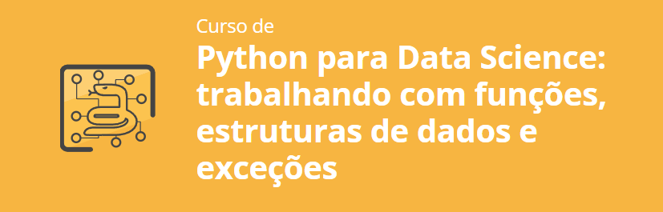

# Python para Data Science: Trabalhando com Funções, Estruturas de Dados e Exceções

Este repositório contém exercícios e projetos relacionados ao uso de Python em Data Science, com foco em funções, estruturas de dados e tratamento de exceções.

## Conteúdo

### 1. Bibliotecas
- Aprenda a utilizar bibliotecas e pacotes no Python, aproveitando suas funcionalidades para resolver problemas comuns em Data Science.

### 2. Funções
- Explore as **built-in functions** do Python e suas utilidades.
- Crie **funções personalizadas** para organizar e reutilizar seu código de forma eficiente.

### 3. Estruturas de Dados
- Trabalhe com **estruturas de dados compostas e aninhadas**, como listas e dicionários.
- Construa listas e dicionários utilizando **list comprehension** e **dict comprehension** para gerar dados de forma concisa e legível.

### 4. Lidando com Exceções
- Diferencie os tipos de **erros e exceções** que podem ocorrer em seu código.
- Aprenda a **tratar erros** e comportamentos indesejados, garantindo que seu código seja robusto e confiável.
