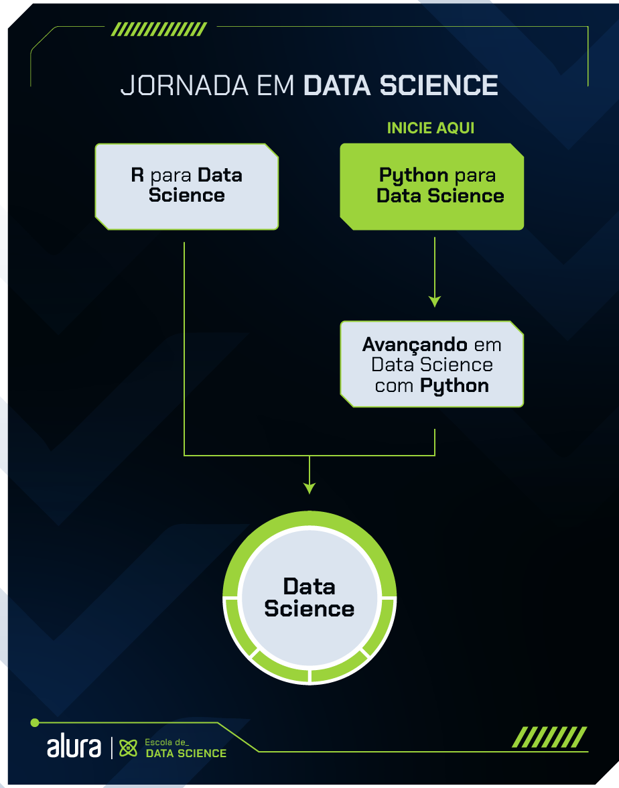

# Formação Python para Data Science

A **Formação Python para Data Science** da Alura é um guia de estudos com o passo a passo necessário para quem deseja aprender sobre uma das áreas com mais demanda de profissionais nos últimos anos. Cada etapa desse processo foi cuidadosamente pensada pela nossa equipe, garantindo que você, ao final da formação, tenha desenvolvido habilidades para enfrentar diversos desafios na área de Ciência de Dados.

## Por que estudar Python?

Python é uma linguagem de código aberto, interpretada e de alto nível, sendo uma das mais utilizadas em projetos de Data Science. Além da facilidade de uso e da sintaxe simples, essa linguagem possui excelentes bibliotecas para lidar com dados, desde a obtenção e limpeza até a exploração e aplicação de modelos de Machine Learning.

## O que aprenderemos?

Na Formação Python para Data Science da Alura, você conhecerá Python, a linguagem mais popular em Data Science, explorando as bibliotecas mais utilizadas, como **Pandas** e **NumPy**. Você aprenderá sobre a coleta, preparação e exploração de dados com o Pandas em projetos dos mais diversos temas.

Se você quer trabalhar com Data Science, esta formação vai te preparar para entrar no mercado e dar seus primeiros passos na profissão.
